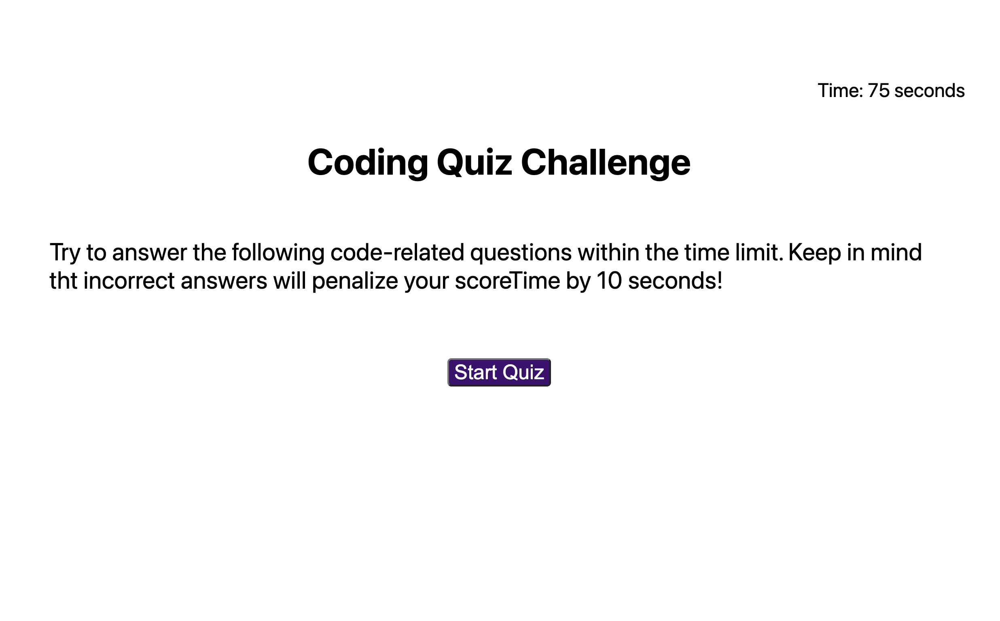
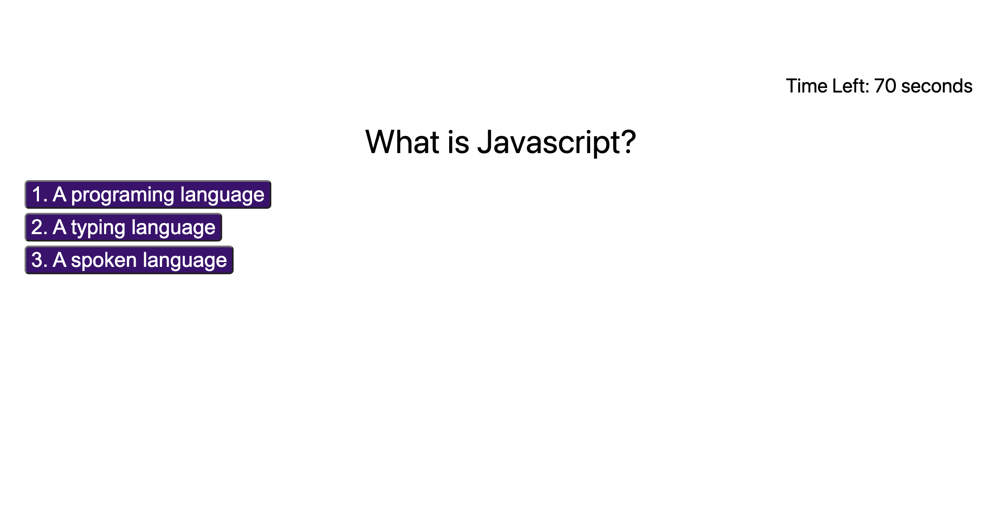

## JavaScript Quiz

With this application, you can challenge your fundamental knowledge of JavaScript through an engaging, timed quiz. In just 75 seconds, put your skills to the test and discover how well you truly understand the JavaScript programming language.

## Table of Contents:

- [How it works](#how-it-works)
- [Tecnologies](#tecnologies-used)
  
### How it works:

1. Press start Quiz
   When quiz has begun, you will have 75 seconds to complete it.

2. Answer the questions
   If incorrect, your score will be affected and you will also lose 10 seconds.

3. Enter your initials
   After completing the quiz you are able to write your initials and save your score in the highscore section.
4. Try again
   Not happy with your score? Click the "Go Back" button and try again!

# Technologies used

1. JavaScript
2. CSS
3. HTML

# Links:

#### Github

https://github.com/KarenHarley/Coding-Quiz-Challenge

#### Website

https://karenharley.github.io/Coding-Quiz-Challenge/

## Contact Info 

Email: KarenHarley88@gmail.com

